# Howdy :wave:
I'm Oscar Capraro, an Undergraduate student at RIT.


Check out:
- [My hammerspoon config](https://github.com/ocapraro/.hammerspoon): How I manage my mac windows
- [Obsidian Math+](https://github.com/ocapraro/obsidian-math-plus): An [Obsidian](https://obsidian.md/) plugin for taking math notes using [Excalidraw](https://github.com/excalidraw/excalidraw)

## Stats





<br><br><br><br><br><br><br><br>
📊 this week i spent my time on:
<!--START_SECTION:waka-->

```txt
No activity tracked
```

<!--END_SECTION:waka-->
